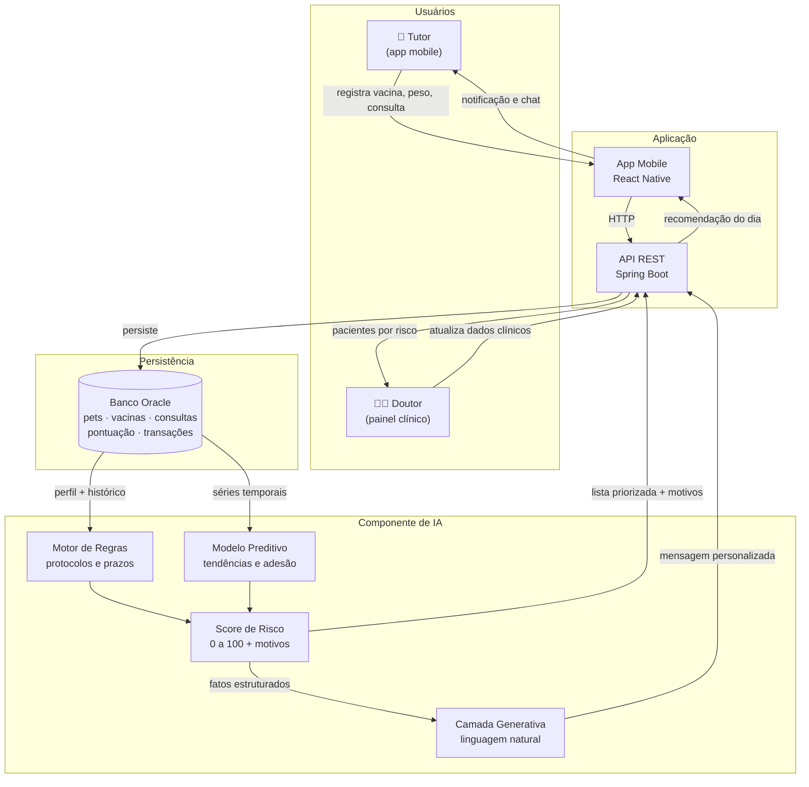

# Componente de Inteligência Artificial — Animed

**Challenge FIAP 2026 · Empresa parceira: Clyvo VET**
Disciplina: *Disruptive Architectures: IoT, IoB & Generative IA* — **Entrega da Sprint 3**

Turma 2TDS — Fevereiro

| Integrante | RM |
|---|---|
| Erick Bernardes Bradaschia | 565733 |
| Gabriel Santos Claudino | 564054 |
| Jonathan Moreira Gomes | 565060 |
| Kaiky de Oliveira Silva (líder) | 566067 |
| Lucas Fortes de Lima | 559523 |

---

## 1. O problema de negócio que a IA vai resolver

A Clyvo VET definiu a dor central do setor: **a jornada de saúde do pet é fragmentada, episódica e reativa**. O tutor só interage com o ecossistema veterinário em momentos pontuais — sintoma agudo, vacina, emergência — e entre um evento e outro não existe acompanhamento.

O Animed já ataca isso com gamificação: cada ação de cuidado vira pontos e moedas, e o tutor sobe de nível. Mas a gamificação, sozinha, tem um limite claro:

> **Ela recompensa o tutor pelo que ele lembrou de fazer — não avisa o que ele deveria fazer, nem em que ordem, nem por quê.**

Um tutor de um Golden Retriever de 9 anos com sobrepeso e vacina atrasada recebe hoje exatamente os mesmos lembretes de um tutor de um SRD de 2 anos saudável. O aplicativo trata os dois como iguais, e é aí que a jornada volta a ser genérica.

### O problema específico tratado pela IA

**Priorizar e personalizar o cuidado preventivo de cada pet, transformando o histórico disperso em uma recomendação clara do que fazer a seguir — antes de o problema acontecer.**

Concretamente, a IA responde três perguntas que hoje ficam sem resposta:

| Pergunta | Quem se beneficia |
|---|---|
| Quais dos meus pacientes estão com risco crescendo agora? | Doutor / clínica |
| O que eu, tutor, devo fazer pelo meu pet nesta semana — e por quê? | Tutor |
| Como eu explico isso ao tutor de um jeito que ele entenda e aja? | Ambos |

### Por que este problema é crítico

- **Para o pet:** doença preventível detectada tarde vira tratamento caro e sofrimento evitável.
- **Para o tutor:** excesso de informação genérica gera ruído; ele desliga as notificações e a jornada morre.
- **Para a clínica:** sem sinal de risco, a clínica só descobre o paciente em risco quando ele chega em emergência — perdendo recorrência, adesão e LTV.

---

## 2. Como a IA contribui

A IA atua em quatro frentes, todas ligadas à jornada contínua:

### 2.1. Personalização

O mesmo evento gera recomendações diferentes conforme **espécie, raça, idade, porte, peso e histórico clínico**. A vermifugação de um filhote segue cadência diferente da de um adulto; raças braquicefálicas têm alertas respiratórios que um SRD de porte médio não tem; um pet acima do peso ideal recebe orientação nutricional que outro não recebe.

### 2.2. Priorização de ações

Em vez de despejar uma lista de pendências, o sistema ordena: **o que é mais urgente para este pet, agora**. Uma vacina antirrábica com 3 meses de atraso pesa mais que um banho fora de dia. Essa ordenação é o que conecta a IA à mecânica de pontos: as ações no topo da lista são também as que rendem mais.

### 2.3. Recomendação de serviços

A partir do perfil e do histórico, o sistema sugere o serviço certo no parceiro certo — check-up geriátrico, exame de sangue pré-cirúrgico, ração terapêutica — respeitando o desconto do nível do tutor. É onde a IA encosta diretamente na monetização.

### 2.4. Apoio à decisão do Doutor

O painel do veterinário recebe a lista de pacientes ordenada por risco, com o motivo explícito ("vacina V10 vencida há 74 dias · ganho de 12% de peso em 4 meses · sem consulta há 11 meses"). O doutor decide quem chamar primeiro.

---

## 3. Abordagem de IA adotada e justificativa

A escolha foi uma **arquitetura híbrida em duas camadas**, e não uma abordagem única.

### Camada 1 — Motor de regras inteligentes + modelo preditivo (Score de Risco)

Calcula um **Score de Risco Preventivo** de 0 a 100 por pet, combinando:

- **Motor de regras determinístico** para o que é protocolo veterinário consolidado: prazos de vacina, vermifugação, antipulgas, periodicidade de check-up por faixa etária.
- **Modelo preditivo (classificação/regressão)** para o que depende de padrão: tendência de peso, intervalo entre consultas, taxa de adesão histórica do tutor, sinais combinados de raça e idade.

**Por que híbrido e não só um modelo?**

1. **Segurança clínica.** Saúde animal não admite recomendação alucinada. Prazo de vacina é norma, não predição — tem que sair de regra auditável, não de inferência estatística.
2. **Explicabilidade.** O sistema precisa dizer *por que* recomendou. Regra explícita é rastreável; modelo puro seria caixa-preta, e o doutor não confiaria.
3. **Dados escassos no início.** Um produto novo não tem histórico volumoso. O motor de regras funciona desde o primeiro pet cadastrado; o modelo preditivo vai ganhando peso conforme a base cresce — estratégia de *cold start*.

### Camada 2 — IA Generativa (LLM) para a interface conversacional

O score e as recomendações são números e códigos. A camada generativa **traduz isso em linguagem natural**, no tom de conversa de mensageiro que a Clyvo aponta como diferencial de experiência:

> *"Oi! O Thor está com a V10 vencida desde julho. Como ele já tem 9 anos, essa é a prioridade da semana — e registrar agora ainda te dá 6 moedas. Quer que eu procure horário na clínica?"*

**Por que LLM aqui e não no cálculo?** O LLM não decide o que é risco — ele **comunica** o que a Camada 1 decidiu. Isso o mantém preso a fatos vindos do banco, elimina o risco de inventar orientação clínica, e ainda permite responder perguntas abertas do tutor ("posso dar osso pro meu cachorro?") com o contexto real daquele pet.

### Resumo da justificativa

| Necessidade | Técnica escolhida | Por quê |
|---|---|---|
| Prazos e protocolos clínicos | Motor de regras | Auditável, correto desde o dia 1, sem alucinação |
| Tendências e padrões | Modelo preditivo | Capta o que regra fixa não vê (evolução de peso, adesão) |
| Ordenação das ações | Score composto | Um número comparável entre pets, usável pelo doutor |
| Conversa com o tutor | LLM (IA Generativa) | Linguagem natural, tom de mensageiro, explicação personalizada |

---

## 4. Dados necessários

Todos os dados vêm do **banco Oracle já modelado nas Sprints 1 e 2** — as sete entidades existentes cobrem a necessidade da IA sem exigir nova coleta.

| Dado | Origem | Estrutura | Como a IA usa |
|---|---|---|---|
| Perfil do pet | Cadastro feito pelo tutor no app | Espécie, raça, idade, porte, peso, histórico de saúde | Define a linha de base do protocolo (o que é esperado para este perfil) |
| Histórico de vacinas | Registro do tutor + edição do doutor | Tipo, data de aplicação, data do próximo reforço | Calcula atraso e peso do risco imunológico |
| Consultas | Registro do tutor / agenda do doutor | Data, motivo, retorno indicado | Mede intervalo desde o último atendimento e adesão a retorno |
| Evolução de peso | Atualizações periódicas no app | Série de peso ao longo do tempo | Detecta tendência de ganho ou perda relevante |
| Medicações | Registro do tutor | Substância, período, continuidade | Avalia adesão a tratamento em curso |
| Histórico de pontuação | Gerado pelo próprio sistema de gamificação | Ação, data, pontos creditados | Mede o padrão de engajamento do tutor (frequência e pontualidade) |
| Transações em parceiros | Compras e check-ins na rede | Item, valor, estabelecimento | Contextualiza recomendação de produto e serviço |
| Dados do tutor | Cadastro feito pelo doutor | Nível, plano, pets vinculados | Aplica desconto correto e ajusta o tom da recomendação |

### Dados que **não** são usados

Nenhum dado sensível do tutor além do necessário à operação. O componente de IA opera sobre dados clínicos do **pet** e sobre o padrão de uso do aplicativo — não sobre dados pessoais identificáveis além do vínculo de posse. Credenciais e documentos nunca entram no contexto enviado ao modelo de linguagem.

---

## 5. Fluxo de dados

### Como o fluxo se comporta na prática

1. O tutor registra uma ação no app (uma vacina, um peso novo).
2. O app envia à API, que persiste no Oracle e credita os pontos conforme a tabela de prazo.
3. O evento dispara o recálculo do score daquele pet: o motor de regras verifica protocolos, o modelo preditivo reavalia tendências.
4. O score volta com os **motivos** que o compõem — nunca só o número.
5. A camada generativa transforma esses motivos em uma mensagem que o tutor entende, dentro do contexto dele.
6. O tutor recebe a recomendação; o doutor vê o mesmo pet reposicionado na fila de risco do painel.

O ciclo se fecha: **a ação do tutor alimenta a IA, e a IA devolve a próxima ação** — que é exatamente a transformação de jornada episódica em jornada contínua que a Clyvo pediu.

---

## 6. Arquitetura de integração

O componente de IA **não é um sistema paralelo**. Ele é um serviço consumido pela API, que segue sendo a única porta de entrada dos dados.

| Camada | Responsabilidade | Onde vive |
|---|---|---|
| Interface | Exibe recomendação, chat e painel de risco | App mobile e painel do doutor |
| Orquestração | Recebe evento, aciona o cálculo, devolve resultado | API REST |
| Inteligência | Calcula score, gera texto explicativo | Serviço de IA |
| Dados | Fonte única da verdade | Banco Oracle |

**Decisões de integração:**

- O serviço de IA **lê o banco através da API**, não diretamente — mantém uma única camada de regra de negócio e evita duplicar validação.
- O recálculo é **disparado por evento** (registro de cuidado, edição clínica do doutor) e não em varredura periódica, para que a recomendação reflita a realidade no momento em que o tutor abre o app.
- A camada generativa recebe **apenas fatos já apurados** pela camada de regras. Ela nunca consulta o banco por conta própria nem decide o que é risco.
- O resultado é **persistido junto ao histórico do pet**, para que o doutor veja a evolução do risco ao longo do tempo e não apenas a foto do momento.

---

## 7. Benefícios

**Para o tutor** — deixa de receber lembrete genérico e passa a receber orientação sobre o *seu* pet, explicada em linguagem comum, com a ação mais importante no topo.

**Para o pet** — o cuidado preventivo deixa de depender exclusivamente da memória do dono.

**Para a clínica** — o doutor enxerga a carteira ordenada por risco, age antes da emergência, recupera recorrência e reduz abandono de tratamento.

**Para a Clyvo** — cada interação alimenta uma base longitudinal de saúde animal que nenhum concorrente tem. É o ativo que sustenta a barreira competitiva: quanto mais o sistema é usado, mais preciso ele fica, e mais difícil fica de substituir.

---

## 8. Continuidade da entrega anterior

O módulo de **visão computacional** entregue na Sprint 1/2 (reconhecimento de cães e gatos com YOLOv8 e OpenCV, neste mesmo repositório) permanece como o canal de **entrada automática de dados**: o check-in por câmera no parceiro identifica o pet e registra a visita sem ação do tutor.

Na arquitetura desta sprint, aquele módulo passa a ser **um alimentador do fluxo descrito acima** — a visita reconhecida vira evento, o evento entra no histórico, e o histórico alimenta o score. As duas entregas se encaixam em vez de conviver soltas.

---

## 9. Escopo desta Sprint e da próxima

| Sprint 3 (esta entrega) | Sprint 4 |
|---|---|
| Definição do problema tratado pela IA | Implementação do serviço de score |
| Escolha e justificativa da abordagem | Integração real com a API e o app |
| Mapeamento dos dados e do fluxo | Camada conversacional funcionando |
| Arquitetura de integração | Testes e validação em cenários de uso |
| Vídeo pitch da proposta | Vídeo pitch da solução funcionando |
